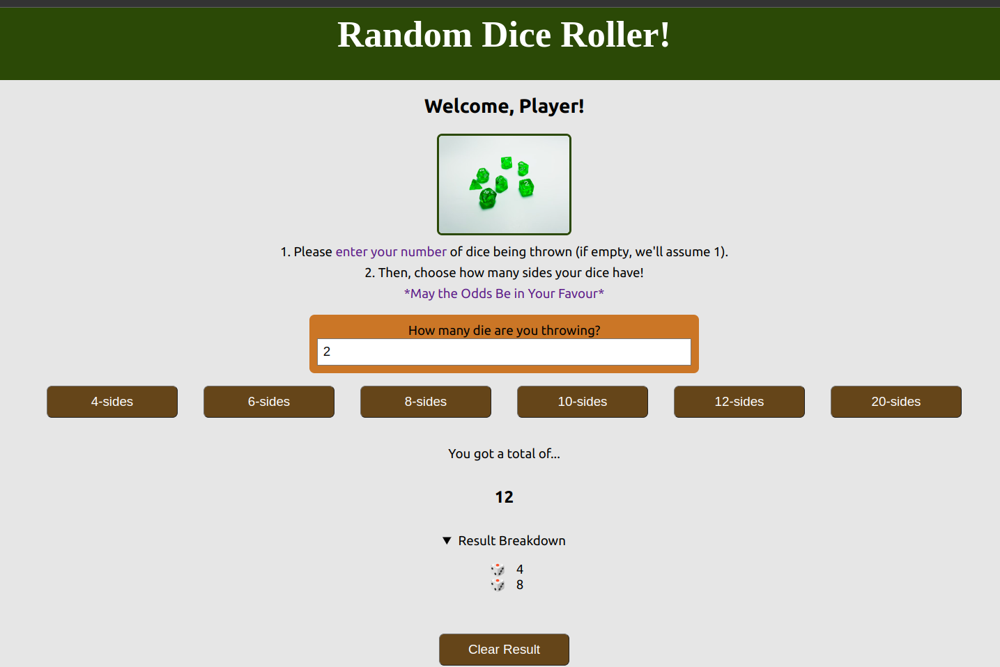

# dice-roller-app

Created using React Frameworks, HTML5, CSS.

Taking inspiration from Dungeons & Dragons games, this dice roller allows the user to roll X number of Y sided die!

# How To View The App?

On Netlify:

View via Github:

- Fork and clone this repo
- Open repo, type in terminal: "cd dice_roller"
- type in terminal: "npm start"
  (the app will open in your browser)
- use app! (suggestion: see if you can get a 1 or 20 when rolling one 20-sided die... does anything happen?)

# Screenshot

